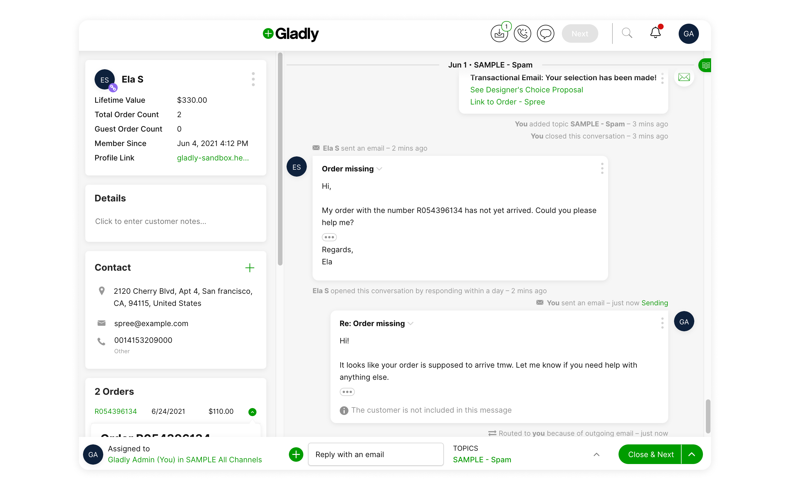

<!-- [TITLE] -->
<p align="center">
  <a href="https://github.com/upsidelab/spree_gladly">
    <!-- [ATTACH LOGO/LANDSCAPE/IMAGE/... RELATED TO THE PROJECT - DIMENSION: 1012 X 300] -->
    
    <h1 align="center">Spree Gladly</h1>
  </a>
</p>
<p align="center">
  <!-- [BRIEF DESCRIPTION, PREFERABLY ONE SENTENCE] -->
  Official Gladly integration for Spree Commerce. Works with:
</p>

<!-- [ADD RELATABLE BADGES] -->
<p align="center">
    <a aria-label="Travis build" href="https://app.travis-ci.com/github/upsidelab/spree_gladly">
    
  </a>
  <a aria-label="Works with Spree versions 3.0" href="https://github.com/spree/spree/releases">
    
  </a>
</p>

<br />
<br />

<!-- [ADDITIONAL DESCRIPTION, PREFERABLY +/- 1-3 SENTENCES, IF MORE, ADD A NEW LINE EVERY 1-3 SENTENCES] -->
This extension allows you to connect your [Spree](https://github.com/spree/spree) store with [Gladly](https://www.gladly.com/) customer service platform. It allows Gladly agents to see information about Spree customers, their orders and events associated with them.

You can read more about the connector in [Gladly help docs](https://help.gladly.com/docs/spree-overview).



## Table of contents

<!-- [ATTACH IMPORTANT SECTIONS IN THE TABLE OF CONTENTS] -->
- [Table of contents](#table-of-contents)
- [Getting started](#getting-started)
- [Configuration](#configuration)
- [Usage](#usage)
- [Setup sandbox environment](#setup-sandbox-environment)
- [Customization](#customization)
- [Testing](#testing)
- [Documentation](#documentation)
- [Contributing](#contributing)
  - [Contributing Guide](#contributing-guide)
  - [Code of Conduct](#code-of-conduct)
- [License](#license)

<!-- [DESCRIBE INSTALLATION STEPS, IF ANY] -->
## Getting started

<!-- [LIST INSTALLATION STEPS IN SIMPLE TERMS, ONE AFTER ANOTHER ANOTHER] -->
>NOTE: Make sure you're using one of supported Spree versions: `3.0`, `3.1`, `3.7`, `4.0`, `4.1`, `4.2`

1. Add 'spree_gladly' gem to your application's Gemfile

    ```ruby
      gem 'spree_gladly'
    ```
2. Install the bundle
    ```bash
      $ bundle install
    ```
3. Run the installer
    ```bash
      $ bundle exec rails generate spree_gladly:install
    ```
4. Done!

<!-- [EXPLAIN FURTHER STEPS IN GETTING STARTED SECTION, AFTER INSTALLATION PROCESS IS COMPLETED] -->
## Configuration

- [Configuring Spree Store](https://docs.upsidelab.io/spree-gladly/configuration/spree-store.html)
- [Configuring Gladly](https://docs.upsidelab.io/spree-gladly/configuration/gladly.html)

## Usage

To understand how the extension works from user's point of view please refer to the [Gladly help docs](https://help.gladly.com/docs/spree-overview).

The implementation adheres to the specification of a Gladly Lookup adapter as described [here](https://developer.gladly.com/tutorials/lookup). The below description will assume that the reader has familiarized themselves with the tutorial.

- [Basic lookup](https://docs.upsidelab.io/spree-gladly/usage/basic-lookup.html)
  - [Manual Search Request](https://docs.upsidelab.io/spree-gladly/usage/basic-lookup.html#manual-search-request)
  - [Automatic Search Request](https://docs.upsidelab.io/spree-gladly/usage/basic-lookup.html#automatic-search-request)
  - [Basic Lookup Response](https://docs.upsidelab.io/spree-gladly/usage/basic-lookup.html#basic-lookup-response)
- [Detailed lookup](https://docs.upsidelab.io/spree-gladly/usage/detailed-lookup.html)
- [How does the search work? What do the fields mean?](https://docs.upsidelab.io/spree-gladly/usage/search.html)
  - [Basic search](https://docs.upsidelab.io/spree-gladly/usage/search.html#basic-search)
  - [Detailed search](https://docs.upsidelab.io/spree-gladly/usage/search.html#detailed-search)
- [Events](https://docs.upsidelab.io/spree-gladly/usage/events.html)


## Setup sandbox environment

[Learn how to setup the sandbox environment](https://docs.upsidelab.io/spree-gladly/sandbox-environment.html).

## Customization

Within spree_gladly gem we distinguish response for guest and registered customer.

For customizing detailed lookup response and more [read the customization docs](https://docs.upsidelab.io/spree-gladly/customization.html).

## Testing

[Learn how to test the integration](https://docs.upsidelab.io/spree-gladly/testing.html).

 <!-- [REFERENCE ALL DOCUMENTATION LINKS] -->
## Documentation

Learn more about using Spree Gladly

- [Guides](https://docs.upsidelab.io/spree-gladly/)
- [Configuring](https://docs.upsidelab.io/spree-gladly/configuration/spree-store.html)
- [Usage](https://docs.upsidelab.io/spree-gladly/usage/basic-lookup.html)
- [Customization](https://docs.upsidelab.io/spree-gladly/customization.html)

<!-- [REFERENCE CONTRIBUTING GUIDE, IF POSSIBLE] -->
## Contributing

We're glad for your interest in Spree Gladly and taking the time to contribute 🧡

### [Contributing Guide](./.github/CONTRIBUTING.md)

Read our [Contributing Guide](./.github/CONTRIBUTING.md) to learn about our development process, how to propose bugfixes and improvements, and how to build and test your changes to the project.

### [Code of Conduct]('./.github/CODE_OF_CONDUCT.md')

Everyone interacting in the SpreeGladly project's codebases, issue trackers, chat rooms and mailing lists is expected to follow the [Code of Conduct]('./.github/CODE_OF_CONDUCT.md').

<!-- [REFERENCE PROJECT LICENSE] -->
## License

Spree Gladly is [BSD 3-Clause "New" or "Revised" licensed](/).
 
---

<p id="author" align="center"><sub>This repository is being developed and maintained by:</sub></p>
<p align="center"><a href="https://upsidelab.io/"></a></p>
